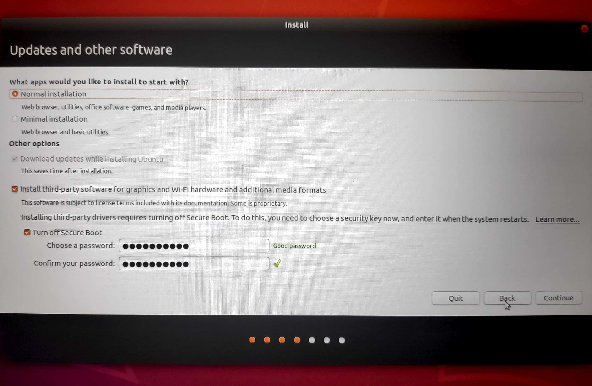
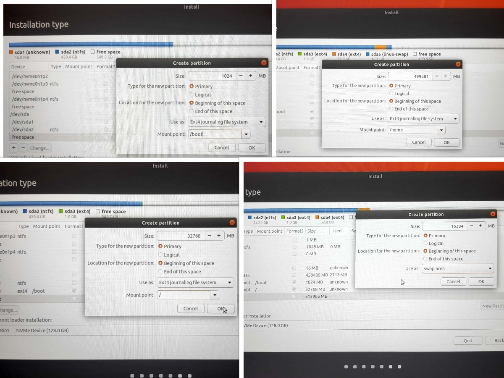

# ubuntuism
Begin your journey with Ubuntu here. This is a tutorial about **Dual Boot of Ubuntu with Windows**

### Part 1 - Windows
**1. Open Disk Management in Windows to partition your disk**
 

**2. Allot space for Ubuntu Installation**  
Select the partition that you want to give for Ubuntu by shrinking the Windows Disk Volume. 
 

Specify the amount of space that you want to allot for Ubuntu.
 

Make a suitable allotment based on your requirement. Ensure you have at least 35 GB of free storage space for Ubuntu 
 

 My Disk Partition is ready. In my 1TB harddisk I am using 512GB for Ubuntu(Unallotted Partition) and the rest for Windows. 
 

**3. Download the Image and create a Bootable USB**  
Download the Ubuntu Image from the offical website 
Link : http://old-releases.ubuntu.com/releases/18.04.3/ubuntu-18.04-desktop-amd64.iso 
Note: While installing I faced certain issues with 18.04.4, thus, I used 18.04.3 version during my installation. 

To flash the image in our system, lets create a bootable pendrive image 
Download Rufus or Etcher to create a bootable USB Image  
Link: https://rufus.ie/   (or) 
Link: https://www.balena.io/etcher/	 
 
 (or) 
  

<ul>
  <li> Insert a formatted pendrive with 4GB space available.  </li>
  <li> Select the location of downloaded Ubuntu image and the pendrive path.  </li>
  <li> Flash the image using any of the 2 softwares.   </li>
</ul>

 
&nbsp; We have successfully completed our pre-requisites. Lets jump into our main course. So you both, Refresh and restart!! :-P 
 

<ul>
Refer : 
  <li> https://support.microsoft.com/en-in/help/17418/windows-7-create-format-hard-disk-partition   </li>
  <li> https://releases.ubuntu.com/18.04.3/   </li>
</ul>
 
 

### Part 2 - Ubuntu Installation

**1. Changing the boot option**   
Power ON the system and immediately press the boot option button F12 continously(in most of the PCs, check it online).  
The system enters the boot menu. Select the "USB Boot" option(Sandisk in my case)  
 

**2. GRUB Menu**  
In the Grub Menu select "Install Ubuntu" option  
 

**3. Select Language**  
 

**4. Select Keyboard Layout**  
 

**5. Select Wireless network settings**  
 

**6. Select the Installation option**  
Select the updates and software that you need. You can proceed with Normal Installation, omit 3rd party softwares and turn off secure boot.  
 

**7. Configure Ubuntu Partition**  
 

<ul>
From your free space shown in the list create 4 partion spaces
  <li> /boot (grub and boot)  </li>
  <li> / (root - superuser)   </li>
  <li> /home (the user)   </li>
  <li> /swap (swap space)   </li>
</ul>
 

<ul>
The recommended partition for a PC with 100 GB Ubuntu space
  <li> swap - 2 times the RAM size (For a 4GB RAM, swap is 8GB)   </li>
  <li> boot - 1GB    </li>
  <li> root - 25GB   </li>
  <li> home - 66GB   </li>
</ul>

Select "Boot Loader Installation Space" as /dev/sda  
My Ubuntu Partition Space with format option selected  
 

You have completed 7.5(Steps) just a few more. 
You should be getting a confirmation page about your partition.  
 

**8. Take Rest - Let it install**  
Proceed with it and your installations would be successfully completed (hopefully :-P)
 

Note : In some cases, you may need to update your BIOS. Check with the Manufacturer. 
  

I too faced errors during my installation and have successfully fixed them. Happy Learning :-P 
